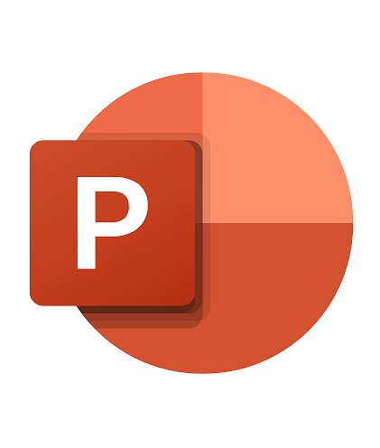

# , I'm Saurabh 

  

### 
I'm a full-time, full-stack data scientist  working primarily in Python. 
 Please browse my repositories and get in touch if you've any questions or suggestions. 🚀
  

## About Me

- 🔭 I’m currently working on [ML Project](https://github.com/SaurabhAradwad/)  

- 🌱 I’m currently learning DL, AI/ML Ops, DevOps 

- ❓ Ask me about anything related to Data Science
 
- ⚡ Fun fact: I like playing [AGE OF EMPIRES](https://www.ageofempires.com/) 
  

   

## My Technical Stack  
<table><tr><td valign="top" width="33%">

### Python Packages  

  
  
  
  
  
  
  
  
  
 
  
  
  
  

  

</td><td valign="top" width="33%">

### AI/ ML Ops  

  
   
  

  
  

  

### Data Analytics and Visualisation Tools  

  
  
  
 
  

 

### Programing Skills  

  
  
  
 

</td><td valign="top" width="33%">

### DevOps  

  
  
  
  
  

  

### Databases  

  
  
  
  

### Cloud Deployment  

  
  
  
  
  
  
  

  

### Other Utilities  

    
  
  

</td></tr></table>  

   

## Github Stats  

  

   

## Credits
I'd like to thank everyone who has helped me with my project work. I should mention a few of them.

- [AlmabBetter](https://www.almabetter.com/), with them I started my Data Science Journey. 
- [ineuron](https://ineuron.ai/) Every tech-support staff, contributor and mentor who has ever reviewed any of my projects, or just replied to the issues I've raised.
- [DataCamp](https://www.datacamp.com/) Thank you for providing such a wonderful way to learn code by performing it step-by-step.
- [Ayush](https://github.com/SharmaAyush98), [Aman](https://github.com/AMAN-GULERIA), [Rishika](https://github.com/Rishika70) for contributing in my project journey

 <em><b>I love connecting with different people</b> so if you want to say <b>hi, I'll be happy to meet you more!</b> </em>
  

  

